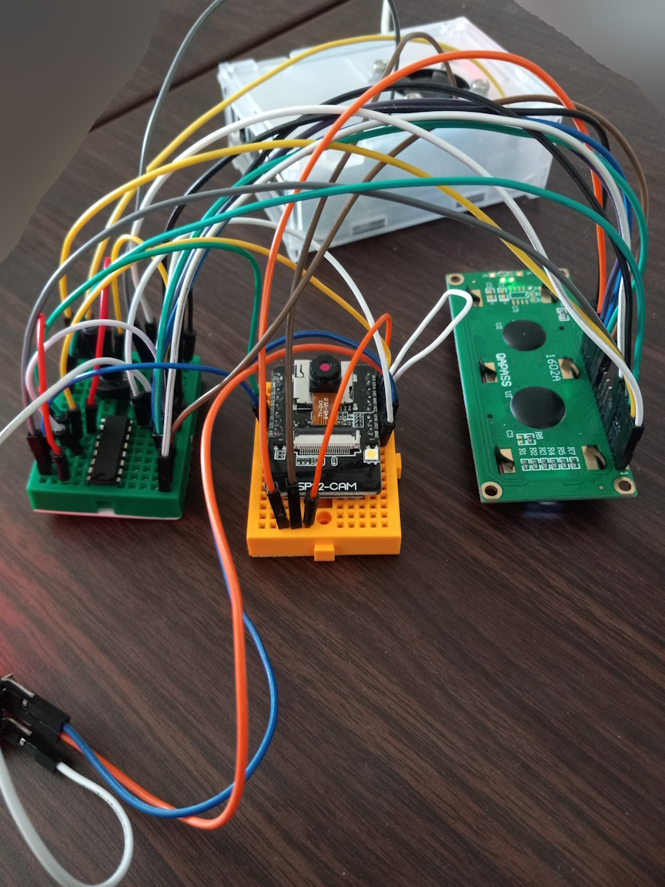
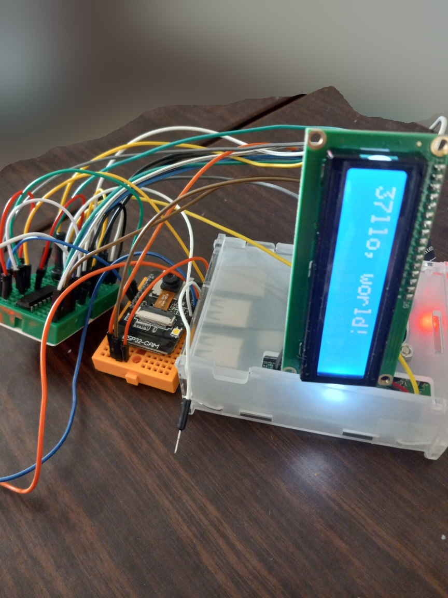
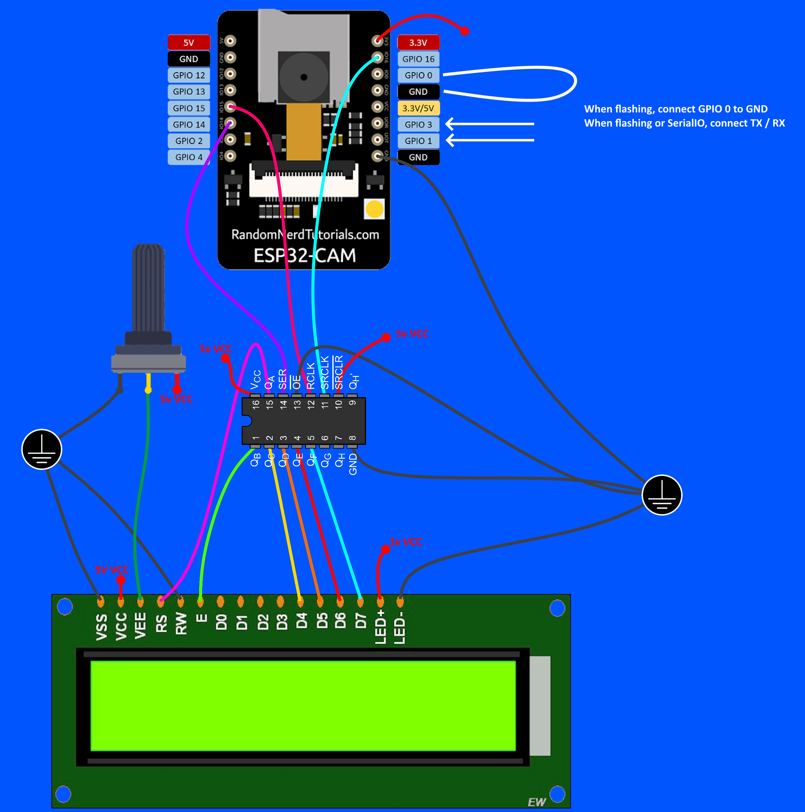

# ESP32-CAM with LCD1602

The ESP32-cam has barely any physically accessible pins, because of the camera and SD card.

We can "extend" the amount of usable pins by using a shift register.

There is a Raspberry PI, but it's only acting as 
a power supply for both 5v and 3.3v.

Here's the schematic:

## Libraries
- https://github.com/davetcc/LiquidCrystalIO
